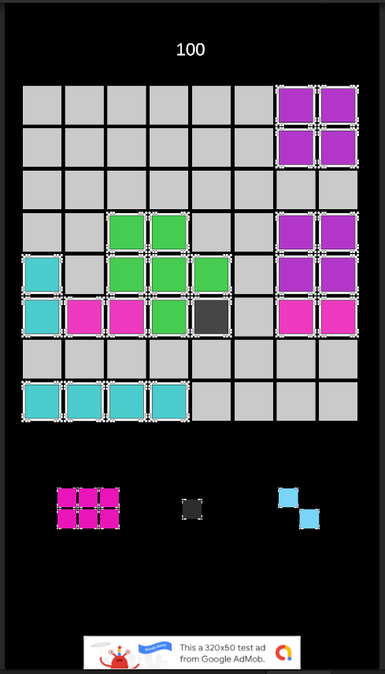
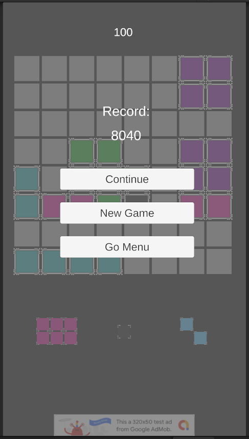

# Block Puzzle (Unity)

> An early Unity project, an Android puzzle game built end-to-end as a vehicle for learning the mobile pipeline: 2D touch input, scene management, persistence, Google AdMob integration with all three ad formats, signed Android builds. The game itself is a clone of the Block Blast / 1010! genre, I picked an established design on purpose so I could focus on the engine and the ad stack, not on game design. Uploaded essentially as-is (ad unit IDs swapped for Google's official test IDs, no other changes), an honest snapshot of where I was as a Unity developer at the time.

<p align="center">
    <a href="youtubeurl...coming...">
    
    </a>
  
</p>

## About this repository

This was an early Unity project. The goal wasn't to design an original game, it was to walk the full mobile pipeline once, without skipping any step: Unity 2D workflow, drag-and-drop touch input, scene management with persistence, ad monetization wired correctly with all three Google AdMob formats, the keystore-signing dance for Android, and an installable `.aab` at the other end. To keep the focus on the pipeline and not on game design, I picked a well-understood puzzle genre (Block Blast / 1010!) and built that. The mechanics were a solved problem; the pipeline wasn't.

I finished the game, signed the build, and got as far as a working `.aab`. I never uploaded it to Google Play.

**It's uploaded essentially as-is**, untouched apart from replacing my real AdMob ad unit IDs with Google's official test IDs (so anyone can clone and build without exposing my account to invalid traffic), because this repo isn't here to showcase "clean code". It's here to show two things:

- that I shipped a complete mobile game with the full ad pipeline working, signed and ready to publish,
- and that today I can look at this code with a critical eye and tell you exactly what's wrong with it.

That second part is documented below, in [Technical debt and decisions I'd revisit](#technical-debt-and-decisions-id-revisit) and [What I'd do differently today](#what-id-do-differently-today).

## What's inside

### The game

8×8 grid, three pieces spawned on the side at a time, drag-and-drop onto the board. Complete a row or a column and it clears, scoring points. Lose when none of the three remaining pieces fit anywhere. One revive available per run, gated behind a rewarded ad. Scoring is colour-aware: a cleared line is worth more if the blocks share colours, with the formula `(line_length + 1 - distinct_colours) × 10`, a row of 8 same-colour blocks is 80 points, 8 different colours is 10. That rewards strategic stacking on top of bare line-clearing.

29 piece shapes defined in `PieceBuilder.PieceType`, ranging from a single block up to 11. Score, record and "already revived" state persisted between sessions via `PlayerPrefs`. Two scenes (`Menu`, `Game`), with `Pause`, `Lose` and `Revive` as `CanvasGroup` panels that fade in and out via coroutines.

### The AdMob integration

The part of this repo I actually learned from.

- **All three ad formats wired up, each with intent.** `AdsManager.cs` initializes the SDK and loads a banner (ambient revenue at the bottom of the play area), an interstitial (shown at game over, the natural pause point), and a rewarded ad (the only way to unlock the one-time revive). Picking the right format for the right moment is the design call that matters, not just "stuff ads in everywhere."
- **The reward as a real game mechanic.** The rewarded ad isn't a "watch this for currency you'll never use" tax. It gates the revive: lose the game, see the offer, watch the ad, get one more shot, persisted so you can't re-trigger it the same run. The `OnUserEarnedReward` `Action` only fires after the SDK confirms the user actually finished the ad, the engagement and the reward stay tied to each other.
- **Async load with reload-on-close.** Each format loads asynchronously after `MobileAds.Initialize`, and the interstitial and rewarded re-request themselves inside `OnAdFullScreenContentClosed`, so by the time the player triggers the next ad event the SDK already has one queued. No "ad not ready" stutter on the second show.
- **Two-tier ID system understood.** AdMob distinguishes the App ID (`ca-app-pub-XXX~XXX`, identifies the whole app, lives in `GoogleMobileAdsSettings.asset` and gets injected into `AndroidManifest.xml` at build time) from the Ad Unit IDs (`ca-app-pub-XXX/XXX`, one per ad slot, live in `AdsManager.cs`). Missing or swapping one for the other crashes the app on launch, a classic onboarding gotcha that I hit and learned from.
- **The full dependency chain.** Importing the Google Mobile Ads Unity Plugin, letting EDM4U (External Dependency Manager for Unity) pull in the Google Play services AARs, switching the build target to Android, configuring the keystore, building a signed `.aab`. The README's [How to build it](#how-to-build-it) section walks the same path.

The ad unit IDs in `AdsManager.cs` are Google's official test units (`ca-app-pub-3940256099942544/...`), which serve test ads with a "Test Ad" label and don't generate revenue or count against any account. They're meant exactly for this, public code, demos, testing. Replace them with your own if you want to monetize.

## How to build it

You'll need:

- **Unity 6 / 2022.3 LTS or later** (open `ProjectSettings/ProjectVersion.txt` to check the exact version I used).
- **Android Build Support** installed via Unity Hub.
- **Google Mobile Ads Unity Plugin**, not bundled, see below.

After cloning:

1. Open the project in Unity. Let it import.
2. **Import TMP Essential Resources** when prompted (`Window → TextMeshPro → Import TMP Essential Resources`). TMP fonts and shaders aren't in the repo because they're a Unity package.
3. **Install the Google Mobile Ads SDK.** Download the latest [Google Mobile Ads Unity Plugin](https://github.com/googleads/googleads-mobile-unity/releases) `.unitypackage` and import it (`Assets → Import Package → Custom Package`). This pulls in `Assets/GoogleMobileAds/` and EDM4U.
4. **Set the AdMob App ID.** Open `Assets/GoogleMobileAds/Resources/GoogleMobileAdsSettings.asset` in the Inspector and set the Android App ID to Google's official test value: `ca-app-pub-3940256099942544~3347511713`. This is *not* the same kind of ID as the ad unit IDs in `AdsManager.cs`, it identifies the app, not an ad slot, and the Unity plugin injects it into `AndroidManifest.xml` at build time. Without it, the app crashes on launch.
5. Switch the build target to Android (`File → Build Settings → Android → Switch Platform`).
6. **(Optional) Use your own ad units.** The ad unit IDs in `AdsManager.cs` are Google's test IDs, replace both them and the App ID from step 4 with your own AdMob values if you want to monetize.

To play without building: install the `.apk` from the [Releases](../../releases) page on any Android device.

## Controls

| Action | Input |
|---|---|
| Move a piece onto the grid | Drag and drop with touch (or mouse in the Editor) |
| Pause | Pause button (top of the play area) |
| Use revive (after losing) | Tap the revive button on the Lose screen, watch the rewarded ad |
| Quit | Android back button (`Esc` in the Editor) |

## Project structure

```
Assets/
└── Project/
    ├── Scripts/
    │   ├── AdsManager.cs         # AdMob: banner, interstitial, rewarded
    │   ├── BlockLineClearer.cs   # Row/column detection, scoring, gizmos
    │   ├── DraggablePiece1.cs    # Touch drag, snap-to-grid, scale animation
    │   ├── GameController.cs     # Score, revive flow, panel fades, scene routing
    │   ├── MenuController.cs     # Main menu, Android back-button handling
    │   ├── PieceBuilder.cs       # 29 piece shapes, procedural block layout
    │   ├── SpriteByNumber.cs     # Maps a numeric index to a sprite/colour
    │   └── TripleSpawner.cs      # Spawns the three pieces shown to the player
    ├── Scenes/                   # Menu.unity, Game.unity
    ├── Sprites/
    └── Prefabs/
ProjectSettings/
Packages/
```

`Assets/GoogleMobileAds/` and `Assets/TextMesh Pro/Examples & Extras/` are intentionally **not** in the repo, they're third-party content that you bring in via the [How to build it](#how-to-build-it) steps above. Keeping them out makes the repo focused on the code I actually wrote.

## Technical debt and decisions I'd revisit

I've reviewed this with hindsight. I'm listing the issues not to make excuses, but to make the point that **I can identify them now**, which is the actual skill that matters.

- **Grid detection by physics overlap, not by data model.** `BlockLineClearer.CheckAndClearLines()` walks every cell in world-space and uses `Physics2D.OverlapCircleAll` to find the closest block. It works, but it's fragile, depends on `startX`, `startY` and `step` being calibrated to match the visual grid exactly, runs an O(rows × cols) physics query on every placement, and breaks subtly if a block ends up a pixel out of alignment. A proper implementation would keep an `int[,] grid` decoupled from the renderer, with blocks snapping to logical coordinates on placement.
- **The revive flag and `PlayerPrefs` can desync.** In `GameController.GoSceneGameRevive()` the `hasRevived` field is set to `true` *before* `ShowRewardedAd()` is called. If the ad fails to load, or the user dismisses it without earning the reward, in-memory state says "revived" but `PlayerPrefs["AlreadyRevive"]` was never updated. The flag should only flip inside `HandleUserEarnedReward`, after the SDK confirms the reward.
- **No combo feedback on simultaneous row + column clears.** When a single piece completes both a row and a column at once, both clear and the points stack, but there's no animation, multiplier, or audio cue, the player can't tell from the result that they did something interesting.
- **`GameController` does too much.** It owns score state, panel fades, ad event subscription, and scene routing. Four responsibilities in one MonoBehaviour. It should split into `ScoreManager` / `UIManager` / `SceneRouter` at minimum.
- **No sound.** Audio was on the to-do list. It never made it in.
- **Comments and Inspector tooltips are in Catalan.** Strings like `"Fila X eliminada amb Y colors"`, Header text like `"Blocs de prefabs disponibles"`, etc. The code itself (identifiers, methods, classes) is in English, but the human-readable strings aren't. I left them as-is, translating them would be cosmetic and a layer of dishonesty about when this was built.
- **`PieceType` is an enum with 29 entries**, and adding a new piece means editing the enum and a `switch` statement in `PieceBuilder.OnValidate()`. This should be a `ScriptableObject` per piece, so new shapes can be created as assets in the Inspector without recompiling.
- **Debug shortcut left in `GameController.Update`**, pressing `P` adds 100 points. Useful while developing the scoring loop, has no business being in a production build.

## What I'd do differently today

If I were rewriting this from scratch:

1. **Model the grid as data first, render second.** Two layers: an `int[,] board` that's the single source of truth for occupancy, line detection, scoring and "can this piece fit here" checks; and a renderer that watches the board and updates GameObjects to match. Decoupling these makes hint preview, undo, AI solvers, and reliable testing all trivial. With the current physics-overlap approach, none of those are.
2. **Pieces as ScriptableObjects.** Each piece becomes a `PieceDefinition` asset with a list of offsets, a colour, a weight for the random spawner. `TripleSpawner` reads from a `PieceCatalog` ScriptableObject. Adding a new piece is "right-click → Create → Piece" instead of "modify enum, add case to switch, recompile."
3. **A real ad-state machine instead of fire-and-forget calls.** `RequestRewardedAd()` and `RequestInterstitial()` reload on close, but there's no `loading / ready / showing / failed` state exposed to the rest of the game. The revive button calls `ShowRewardedAd()` and hopes. A small state machine inside `AdsManager` with events for each transition would let the UI grey out the revive button until the ad is actually ready, instead of silently failing.
4. **Persistence as a single serialized object, not loose `PlayerPrefs` keys.** A `SaveData` class with `Points`, `RecordPoints`, `AlreadyRevive`, etc., serialized to JSON and written once per change, instead of three separate `PlayerPrefs.SetInt` calls scattered across the codebase.
5. **Touch input via `EventSystem` and `IDragHandler`**, not custom raycasting. `DraggablePiece1` reinvents the drag pattern. Unity's UI event system already handles touch-vs-mouse, multi-finger rejection, and edge cases for free.
6. **Tests around the pure logic**, line detection, scoring, the colour-count formula, "can this piece fit here." None of this requires Unity to test if it were separated from the rendering, which is exactly the kind of decoupling point 1 would unlock.

None of this is going to be applied to this repo. It is what it is, and that's the point of keeping it public.

## Stack

- **Engine:** Unity (2022.3 LTS or later, check `ProjectSettings/ProjectVersion.txt`)
- **Language:** C#
- **Platform:** Android
- **Monetization:** Google AdMob, banner, interstitial, rewarded
- **UI:** Unity UGUI + TextMesh Pro
- **Persistence:** `PlayerPrefs`

## Third-party

The code is mine. The external dependencies are:

- **[Google Mobile Ads Unity Plugin](https://github.com/googleads/googleads-mobile-unity)** by Google, used for the AdMob integration. Not bundled in this repo to keep it focused on my code, you install it yourself during [How to build it](#how-to-build-it). Licensed under Apache 2.0.
- **TextMesh Pro**, a built-in Unity package installed automatically by the Package Manager.

### Assets

The visual assets (sprites, fonts, UI elements) were sourced from free-use packs I gathered online while building the game. I didn't keep a precise attribution list at the time, which I should have. **If you recognize an asset that has a more restrictive licence than I assumed, that I should be crediting explicitly, or that shouldn't be in this repo at all, please [open an issue](../../issues) and I'll fix it as soon as I can.**

## License

MIT, see [LICENSE](LICENSE).

---

*If you made it this far: thanks for taking a look. If you find a bug, want to comment on the code, or just tell me how you'd have done it, open an issue. I'd genuinely love to hear about it.*